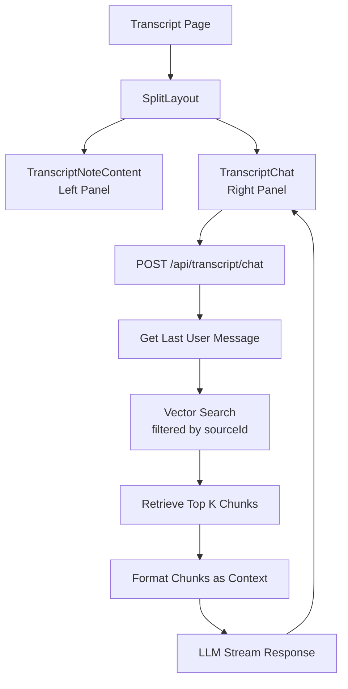

# Transcript Chat with Vector Search

## Overview

Add vector-search-powered chat to the transcript detail page using a split layout. The chat will query transcript chunks via vector similarity search instead of using a simple summary context.

## Architecture




## Implementation Details

### 1. New API Route: `/api/transcript/chat/route.ts`

**Location**: `apps/rag-youtube/app/api/transcript/chat/route.ts`**Functionality**:

- Accepts `messages` (UIMessage[]) and `sourceId` (string) in request body
- Extracts the last user message as the search query
- Performs vector similarity search using `vectorStore.similaritySearchWithScore(query, k, { sourceId })`
- Formats top 5-10 chunks as context
- Uses `streamText` with retrieved chunks in system prompt
- Returns streaming response

**Key Implementation**:

```typescript
// Get last user message
const lastMessage = messages[messages.length - 1];
const query = lastMessage.content; // Extract text content

// Vector search filtered by sourceId
const results = await vectorStore.similaritySearchWithScore(
  query,
  10, // top k results
  { sourceId } // filter by sourceId in metadata
);

// Format chunks as context
const context = results
  .map(([doc, score], i) => `[Chunk ${i + 1}]\n${doc.pageContent}`)
  .join('\n\n---\n\n');

// Stream with context
const result = streamText({
  model,
  messages: convertToModelMessages(messages.slice(0, -1)), // all but last
  system: `You are a helpful assistant answering questions about a video transcript.
  
Use the following relevant transcript chunks to answer the user's question:

${context}

Answer based on the provided chunks. Be accurate and cite specific parts when relevant.`
});
```


### 2. New TranscriptChat Component

**Location**: `apps/rag-youtube/components/transcript-chat.tsx`**Based on**: Existing `components/chat.tsx` but:

- Uses `/api/transcript/chat` endpoint
- Accepts `sourceId` prop instead of `noteContext`
- Passes `sourceId` in request body
- Customized empty state and placeholder text for transcript context

**Key Changes**:

```typescript
type TranscriptChatProps = {
  sourceId: string;
};

export const TranscriptChat = ({ sourceId }: TranscriptChatProps) => {
  const { messages, sendMessage, status } = useChat({
    transport: new DefaultChatTransport({
      api: "/api/transcript/chat",
      body: { sourceId }, // Pass sourceId instead of noteContext
    }),
  });
  // ... rest similar to Chat component
};
```


### 3. Modify Transcript [ID] Page

**Location**: `apps/rag-youtube/app/(protected)/transcript/[id]/page.tsx`**Changes**:

- Import `SplitLayout` and `TranscriptChat`
- Wrap content in `SplitLayout`
- Left panel: `TranscriptNoteContent` (existing)
- Right panel: `TranscriptChat` with `sourceId={note.sourceId}`

**Implementation**:

```typescript
return (
  <div className="h-screen">
    <SplitLayout
      left={<TranscriptNoteContent note={note} />}
      right={<TranscriptChat sourceId={note.sourceId} />}
    />
  </div>
);
```


## Why Not Use agent.ts?

The `agent.ts` file is not suitable because:

- Hardcoded to `video1` and `video_id` metadata
- Uses LangGraph which is overkill for simple RAG
- Filters by `video_id` instead of `sourceId` (transcript system uses `sourceId`)
- Designed for script-based usage, not API routes

We'll use a simpler RAG pattern: vector search → format context → LLM stream, which is more appropriate for this use case.

## Files to Create/Modify

1. **Create**: `apps/rag-youtube/app/api/transcript/chat/route.ts` - New API route for vector search chat
2. **Create**: `apps/rag-youtube/components/transcript-chat.tsx` - New chat component for transcripts
3. **Modify**: `apps/rag-youtube/app/(protected)/transcript/[id]/page.tsx` - Add split layout with chat

## Dependencies

- Existing `vectorStore` from `@/ai/embeddings` (supports filtering by `sourceId`)